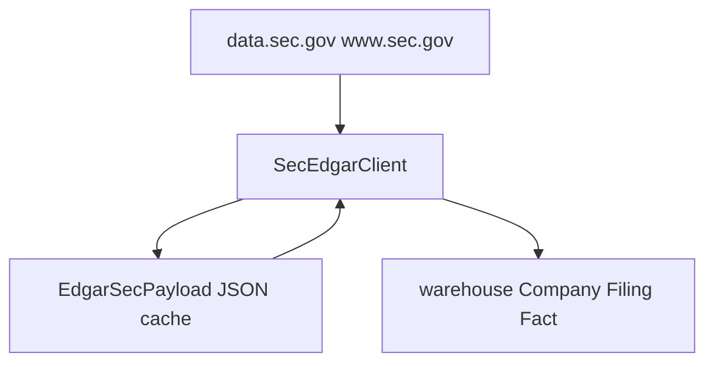

# Architecture

## Stack

- **Backend:** Python 3.12+, Django 5+, Django REST Framework, PostgreSQL or SQLite (`DATABASE_URL`).
- **Frontend:** React, TypeScript, Vite ([`frontend/`](../frontend/)).
- **External APIs:** SEC `data.sec.gov` / `www.sec.gov` (no API key; `User-Agent` must identify the client). Optional FRED for macro series (`FRED_API_KEY`).

## Django apps

| App | Role |
|-----|------|
| `warehouse` | Core models: `Company`, `ListedIssuer`, `Filing`, `Fact`, `Section`, `Table`, `DerivedMetric`, `PeerGroup`, CRM staging (`CrmCompanyRecord`), and `EdgarSecPayload` / `EdgarEntitySyncState`. |
| `sec_edgar` | HTTP client, HTM parsing, sync/ingest services, reference JSON loaders, management commands for SEC workflows. |
| `public_data` | External time series registry (`ExternalSeries`, `SeriesBundle`, `SeriesObservation`) and FRED sync. |
| `api` | Versioned REST under `/api/v1/`; [`api.urls`](../src/api/urls.py) mirrors the same routes at `/api/` for legacy clients. |

Settings and URL wiring live in [`src/config/`](../src/config/).

## Data flow (EDGAR)

1. **Listed issuers** — `company_tickers.json` is fetched and stored in `ListedIssuer` for search and resolution without hammering SEC on every query.
2. **Submissions** — Per CIK, submission index JSON may be read from `EdgarSecPayload` (kind `submissions`) if present; otherwise the client fetches from SEC and can persist the payload. Rows become `Filing` records.
3. **Facts** — `companyfacts` JSON similarly uses `EdgarSecPayload` (kind `company_facts`) when available, then normalizes into `Fact` rows.
4. **HTM** — Optional filing download and parse into `Section` / `Table` via shared ingest services (CLI and API).

**DB-first SEC JSON:** [`EdgarSecPayload`](../src/warehouse/models.py) holds raw submissions and companyfacts blobs keyed by CIK so repeated reads and bulk jobs can avoid redundant live SEC calls. Sync commands and the API respect this cache where configured; use flags such as `force_refresh` or command-line equivalents when you need to bypass it.

## CRM pipeline (optional)

CRM JSON loads into `CrmCompanyRecord`. Title matching links rows to SEC issuers; sync commands can then pull submissions/facts for matched companies. See [api-and-cli.md](api-and-cli.md) for command names.

## Macro data (FRED)

`SeriesBundle` groups `ExternalSeries` IDs. `load_series_bundle` registers definitions; `sync_series_bundle` pulls observations when `FRED_API_KEY` is set.
